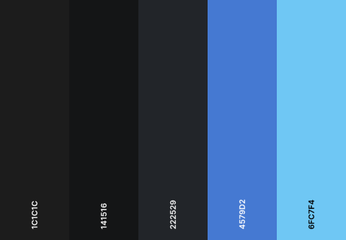

# 🌐 Wit-Projekt

Wit-Projekt to responsywna strona internetowa stworzona w celach edukacyjnych. Projekt zawiera kilka podstron, takich jak portfolio, blog, galerie zdjęć oraz stronę "O mnie". Strona została zaprojektowana z myślą o estetyce, funkcjonalności i łatwości nawigacji.

---

## 📖 Spis Treści

- [🌐 Wit-Projekt](#-wit-projekt)
  - [📖 Spis Treści](#-spis-treści)
  - [📋 Opis Projektu](#-opis-projektu)
  - [🌐 Podstrony](#-podstrony)
  - [🛠 Technologie](#-technologie)
  - [💼 Struktura folderów](#-struktura-folderów)
  - [🎨 Kolory i Czcionki](#-kolory-i-czcionki)
    - [Kolory](#kolory)
    - [Czcionki](#czcionki)
  - [🚀 Uruchomienie](#-uruchomienie)
  - [📧 Kontakt](#-kontakt)
  - [#️⃣ Przyciski](#️⃣-przyciski)
  - [📝 Prompty do AI](#-prompty-do-ai)

---

## 📋 Opis Projektu

Wit-Projekt to strona internetowa, która prezentuje portfolio, blog oraz galerie zdjęć. Strona zawiera dynamiczne elementy, takie jak zmieniające się opisy, interaktywne galerie oraz możliwość zmiany motywu kolorystycznego. Projekt został stworzony z myślą o responsywności, dzięki czemu działa poprawnie na różnych urządzeniach.

---

## 🌐 Podstrony

- **🏠 Strona Główna**: Wprowadzenie do strony, linki do portfolio i sekcji "O mnie".
- **👤 O mnie**: Informacje o autorze, zmieniające się opisy, dynamiczne linki do social mediów.
- **📨 Kontakt**: Strona umożliwiająca wysłanie wiadomości z pytaniem
- **📁 Portfolio**: Projekty z możliwością nawigacji między sekcjami.
- **🖼 Galerie**:
  - Zdjęcia prawdziwe
  - Zdjęcia z gier
- **📝 Blog**: Lista postów z możliwością wyświetlenia szczegółów w modalu.
- **🔒 Logowanie**: Formularz logowania do panelu admina.

---

## 🛠 Technologie

- **🌐 HTML5**: Struktura strony.
- **🎨 CSS3**: Stylizacja, animacje, responsywność.
- **⚙️ JavaScript**: Interaktywność, dynamiczne elementy.
- **💾 PHP**: Obsługa formularzy, logowania/rejestracji, dodawanie i zapisywanie postów.

---
## 💼 Struktura folderów
```
├───404-page
├───About
│   └───Game-covers
├───Blog
│   ├───login-and-register
│   └───posts
├───Contact-site
├───Gallery-gaming
├───Gallery-real-photo
├───Homepage
├───Images
│   ├───gamesGallery
│   ├───Icons
│   │   └───footer-icons
│   └───rlGallery
└───Projects
``` 
---
## 🎨 Kolory i Czcionki

### Kolory

- **🎨 Główne**:
  - `--clr-primary`: #1c1c1c
  - `--clr-primary-2`: #4579d2
  - `--clr-primary-2-1`: #6fc7f4
  - `--clr-primary-3`: #141516
  - `--clr-primary-4`: #222529
  - `--clr-font`: #ffffff
  

- **🌈 Motywy**:
  - Jasny: Zmiana na jaśniejsze odcienie.
  - Midnight: Fioletowe i niebieskie odcienie.

### Czcionki

- **🖋 Comfortaa**: Używana w całym projekcie, zapewnia nowoczesny i czytelny wygląd.
- **🖋 Wingdings**: Używana tylko w pewnej sytuacji...
---

## 🚀 Uruchomienie

1. 📥 Pobierz projekt i rozpakuj go.
2. 🌐 Otwórz plik `index.html` w przeglądarce.
3. 🎉 Strona jest gotowa do zabawy.

---

## 📧 Kontakt

Jeśli masz pytania lub sugestie, skontaktuj się ze mną przez maila, lub przez stronę:

- **📧 E-mail**: [sz.kubiak@onet.eu](mailto:sz.kubiak@onet.eu)

## #️⃣ Przyciski

 **🏠 Strona Główna**: 
  
  1: Przycisk ten przenosi nas do podstrony zawierającej [Portfolio](#-podstrony)  
  2: Przycisk ten przenosi nas na podstronę umożliwiającej wysłanie wiadomości do mnie 

 **👤 O mnie**: 
  
  1: (Niewidzoczny tutaj) Podgląd strony Spotify umożliwiający odsłuchanie fragmentu piosenek dodanych w kodzie  
  2: Zmieniający się przycisk z kafelkami do moich profili na różnych stronach  

 **📨 Kontakt**: 
  
  1: Pola służące do wprowadzania danych, kolejno: imienia, maila, oraz treści wiadomości  
  2: Przycisk służący do wysłania wcześniej napisanej wiadomości  

 **📁 Portfolio**: 
  
  1: Przycisk służący na powrót do [Strony głównej](#-podstrony)  
  2: Przyciski służące do przewijania kart portfolio w górę i w dół  
  3: Przycisk służący do przejścia na wybraną stronę mojego [Portfolio]
  (#-podstrony)    

 **🖼 Galerie**:
  
  1: Naciśniecie zdjęcia spowoduje wyświetlenie się jego powiękosznej wersji na ekranie  

 **📝 Blog**: 
  
  1: Przycisk ten służy do przejscia na stronę [Logowania](#-podstrony)  
  2: Naciśnięcie posta spowoduje wyświetlenie się jego pełnej wersji w większym okienku

 **🔒 Logowanie**: 
  
  1: Pola służące do wprowadzania danych kolejno: loginu i hasła do panelu admina na stronie
  2: Przycisk służący do zaakcpetowania danych i zalogowania do konta admina   
 **🐸 Nagłówek**:
    
  1: Łącza te służą do przechodzenia na opisane w nich podstrony  
  2: Przycisk ten po naciśnięciu pokazuje wszystkie motywy do wyboru na stronie  

## 📝 Prompty do AI  
- Wygeneruj mi minimalistyczny favicon do projektu nt. portfolio, technologii itd.
- Jak moge ograniczyc obrot tej karty (Chodzi o kartę na podstronie "O mnie")
- Pomóż napisać zapis do pliku txt w PHP
- Napraw działąnie funckji mail() w PHP